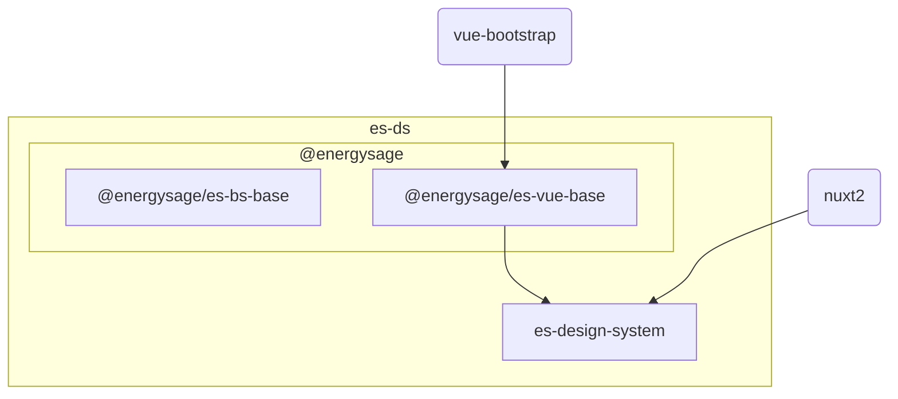

# EnergySage Design System

This is a **monorepo** containing the elements required for building experiences following the EnergySage Design System of _es-ds_ for short.

- [The parts](#the-parts)
- [Contributing](#contributing)
- [Public Works](#public-works)

## The Parts

The EnergySage Design System is composed of 2 core npm packages [@energysage/es-bs-base](https://www.npmjs.com/package/@energysage/es-bs-base), and [@energysage/es-vue-base
](https://www.npmjs.com/package/@energysage/es-vue-base)



### es-bs-base

[es-bs-base](./es-bs-base/) is a drop-in replacement for **bootstrap 4**.

This package overrides the `_variables.scss` file in bootstrap to the ones use defaults required by the energysage design system.

There's additional variables and colors that diverge from the core bootstrap framework.

### es-vue-base

[es-vue-base](./es-vue-base/) contains vue components for use in nuxt projects. It has a dependency of [bootstrap-vue](https://bootstrap-vue.org/) as components extends or are composed of bootstrap components.

`es-bs-base` is a sibling dependencies and should provide the baseline CSS styling to vue rendered components.

### es-design-system

This is our design-system documentation branch, and reference integration for the `es-ds` packages.

## Contributing

### Setting up the repo

clone `git@github.com:EnergySage/es-ds.git`

When publishing changes you will commit to the _origin_ branch of the _es-ds_ repo. So your git set-up should look like this:

```bash
$ git remote -v
origin  git@github.com:EnergySage/es-ds.git (fetch)
origin  git@github.com:EnergySage/es-ds.git (push)
```

Next you should run `make install`. This will kick-off installing requirements for the repo.

#### Vue Component Process

##### Unit Tests

When adding vue components to [es-vue-base](./es-vue-base/src/lib-components), it is expected that you also write [unit-tests](./es-vue-base/tests/).

At a minimum it's recommended you create a snapshot test to catch any potential regressions in rendered output. Depending on complexity further tests may be required.

Tests can be run via `make test`, but this will run tests for all packages in the repo. For faster feedback, you can `cd es-vue-base` and run `npm run test` to only run tests for the _es-vue-base_ package.

##### Building & Re-linking

Once tests are passing, you'll need to rebuild the _es-vue-base_ package. This can be done via `npm run build`.

Next you'll want to move back to the root of the monorepo, and run `make update`. This will ensure the new package is _sym-linked_ to the other projects in the monorepo.

### Documenting the change

Once your changes have been made, you'll want to ensure they're documented somewhere in `es-design-system`. If the change is a new component, it's expected you'll create a new page to display the component.

_Note_ This step also functions as a form of integration testing as it will validate the component will import and render on a nuxt page.

### Publishing and Versioning

For simplicity of deployment, versioning of packages are fixed and updated together.

#### Publishing a new version of a package

Assuming changes are approved, the process of publishing a new version is...

1. Run tests `make test`
2. Build & Compile `make build`
3. Merge in Changes
4. Run `make publish`
5. `make update`
6. Update changelog

Running `make publish` will trigger the following prompt:

```
lerna info Looking for changed packages since v0.1.9
? Select a new version (currently 0.1.9)
❯ Patch (0.1.10)
  Minor (0.2.0)
  Major (1.0.0)
  Prepatch (0.1.10-alpha.0)
  Preminor (0.2.0-alpha.0)
  Premajor (1.0.0-alpha.0)
  Custom Prerelease
  Custom Version
```

You'll note the lerna script will walk you through versioning, then push your changes, and tag the release in git.

This project follows [semantic versioning](https://semver.org/). Please make sure your change in version reflects the semantics defined via semver. At a high level the guidelines are:

1. MAJOR version changes introduce incompatible API changes. API changes could mean:
    - removal of core-components used in other verticals
    - changing "props" of core-components causing breaking changes in other verticals
2. MINOR version changes add functionality in a backwards compatible manner. This could mean:
    - changing the hex value represented by the variable `$white` in `es-bs-base`
    - adding an additional "prop" to a core-component, but otherwise not chancing the default behavior
3. PATCH version changes are backwards compatible bug-fixes and should have no impact on functionality aside from fixing a bug

## Public Works

This repository `es-ds` **is public** and the contents are licensed under the
[MIT](https://tldrlegal.com/license/mit-license#summary)

For that reason discussion and documentation specific to EnergySage should probably be kept
within private org channels.

### EnergySage specific channels

- [Design System Engineering](https://energysage.atlassian.net/wiki/spaces/DSE/overview) confluence page
- [UX + Design](https://energysage.atlassian.net/wiki/spaces/UX/overview)

For EnergySage specific questions and information
please use email, slack, confluence, or jira.
