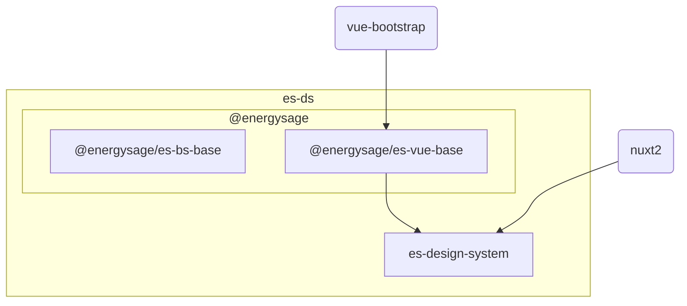

# EnergySage Design System

This is a **monorepo** containing the elements required for building experiences
following the EnergySage Design System of _es-ds_ for short.

- [Public Works](#public-works)
- [The parts](#the-parts)
- [Contributing](#contributing)

## Public Works

This repository `es-ds` **is public** and the contents are licensed under the
[MIT](https://tldrlegal.com/license/mit-license#summary)

For that reason discussion and documentation specific to EnergySage should probably be kept
within private org channels.

### EnergySage specific channels

For EnergySage specific resources & channels see the
[Quick Links section of the Design System confluence page](https://energysage.atlassian.net/wiki/spaces/DS/overview#%F0%9F%96%B1%EF%B8%8F-Quick-Links)

## The Parts

The EnergySage Design System is composed of 2 core npm packages:

- [@energysage/es-bs-base](https://www.npmjs.com/package/@energysage/es-bs-base)
- [@energysage/es-vue-base](https://www.npmjs.com/package/@energysage/es-vue-base)



### es-bs-base

[es-bs-base](./es-bs-base/) started as a fork **bootstrap 4**.

This package overrides the `_variables.scss` file in bootstrap to the ones use
defaults required by the energysage design system.

There's additional variables and colors that diverge and extend from the core
bootstrap framework.

Additionally the SASS has been refactored to use
[the modular system](https://sass-lang.com/blog/the-module-system-is-launched/)
and dart-sass compiler.

`es-vue-base` has a peer-dependency of
[bootstrap-vue](https://bootstrap-vue.org/) which is used for vue components.
Associated styling is vendorized in `es-bs-base` and re-written using the SASS
modular system.

### es-vue-base

[es-vue-base](./es-vue-base/) contains vue components for use in nuxt projects.
It has a dependency of [bootstrap-vue](https://bootstrap-vue.org/) as components
extends or are composed of bootstrap components.

`es-bs-base` is a sibling dependencies and should provide the baseline CSS
styling to vue rendered components.

### es-design-system

This is our design-system documentation branch, and reference integration for
the `es-ds` packages.

## Contributing

### Setting up the repo

clone `git@github.com:EnergySage/es-ds.git`

When publishing changes you will commit to the _origin_ branch of the _es-ds_
repo. So your git set-up should look like this:

```bash
$ git remote -v
origin  git@github.com:EnergySage/es-ds.git (fetch)
origin  git@github.com:EnergySage/es-ds.git (push)
```

### Installing Dependencies and Linking packages

1. `make install` - installs all packages from npm
2. `make update-peer-deps` - installs necessary peer deps for `es-vue-base` used
   in `es-design-system`
3. `make build-scss-pkg` - build `es-bs-base/dist` locally; we do this first
   since `es-vue-base` imports it `@import '~@energysage/es-bs-base/scss/includes'`
4. `make symlink` - [symlink or bootstrap](https://lerna.js.org/docs/features/bootstrap) `es-bs-base/dist`
5. `make build-vue-pkg` - build `es-vue-base/dist` locally
6. `make symlink` - [symlink or bootstrap](https://lerna.js.org/docs/features/bootstrap)
   `es-bs-base/dist` and `es-vue-base/dist` for use in `es-design-system`

### Development Workflow

To develop with hot reloading for all packages you'll want to run `make dev` in
the `es-ds` directory. This will build and package `es-bs-base` and
`es-vue-base` and symlink them to `es-design-system` for use in the nuxt app. It
will then start a dev instance for `es-design-system` that will be available at
`http://localhost:8500`.

Hot reloading will take longer than a typical nuxt app, as it will need to
rebuild the packages and re-link them. This is expected.

#### Vue Component Process

##### Unit Tests

When adding vue components to [es-vue-base](./es-vue-base/src/lib-components),
it is expected that you also write [unit-tests](./es-vue-base/tests/).

At a minimum it's recommended you create a snapshot test to catch any potential
regressions in rendered output. Depending on complexity further tests may be
required.

Tests can be run via `make test`, but this will run tests for all packages in
the repo. For faster feedback, you can `cd es-vue-base` and run `npm run test`
to only run tests for the _es-vue-base_ package.

##### Building & Re-linking

Once tests are passing, you'll need to rebuild the _es-vue-base_ package. This
can be done via `npm run build`.

Next you'll want to move back to the root of the monorepo, and run `make
symlink`. This will ensure the new package is _sym-linked_ to the other projects
in the monorepo.

### Documenting change

Once your changes have been made, you'll want to ensure they're documented
somewhere in `es-design-system`. If the change is a new component, it's expected
you'll create a new page to display the component.

_Note_ This step also functions as a form of integration testing as it will
validate the component will import and render on a nuxt page.

### Publishing and Versioning

For simplicity of deployment, versioning of packages are fixed and updated
together.

#### Publishing a new version of a package

Assuming changes are approved, the process of publishing a new version is...

0. Ensure your local environment is
   [setup](./README.md#installing-dependencies-and-linking-packages) and you are on
   the `main` branch
1. `npm login` - Logs you into the npm.js registry. You'll need access to our `es-ds` package there in order for things to work.
2. `make install && make symlink` - Install the new published versions locally
   and symlink them
3. `make build` - Build all packages to `*/dist` folders locally
4. `make lint && make test` - Run tests and linting to ensure they pass
5. `make publish` - Publish updated packages to
   [npmjs.com](https://www.npmjs.com/org/energysage)
6. Update [CHANGELOG.md](./CHANGELOG.md) with our newly published changes
7. `make install && make symlink` - Install the new published versions locally
   and symlink them
8. `git commit -m "docs: :memo: add version X.X.X to the changelog" && git push` -
   Commit and push the changelog and `package-lock.json` updates
9. For updating the design-system website see
   [Deploy Design System](https://energysage.atlassian.net/wiki/spaces/DSE/pages/208568321/Deploy+Design+System+Documentation)

Running `make publish` will trigger the following prompt:

```shell
lerna info Looking for changed packages since v0.1.9
? Select a new version (currently 0.1.9)
❯ Patch (0.1.10)
  Minor (0.2.0)
  Major (1.0.0)
  Prepatch (0.1.10-alpha.0)
  Preminor (0.2.0-alpha.0)
  Premajor (1.0.0-alpha.0)
  Custom Prerelease
  Custom Version
```

You'll note the lerna script will walk you through versioning, then push your
changes, and tag the release in git.

This project follows [semantic versioning](https://semver.org/). Please make
sure your change in version reflects the semantics defined via semver. At a high
level the guidelines are:

1. MAJOR version changes introduce incompatible API changes. API changes could
   mean:
    - removal of core-components used in other verticals
    - changing "props" of core-components causing breaking changes in other verticals
2. MINOR version changes add functionality in a backwards compatible manner.
   This could mean:
    - changing the hex value represented by the variable `$white` in
      `es-bs-base`
    - adding an additional "prop" to a core-component, but otherwise not
      chancing the default behavior
3. PATCH version changes are backwards compatible bug-fixes and should have no
   impact on functionality aside from fixing a bug
