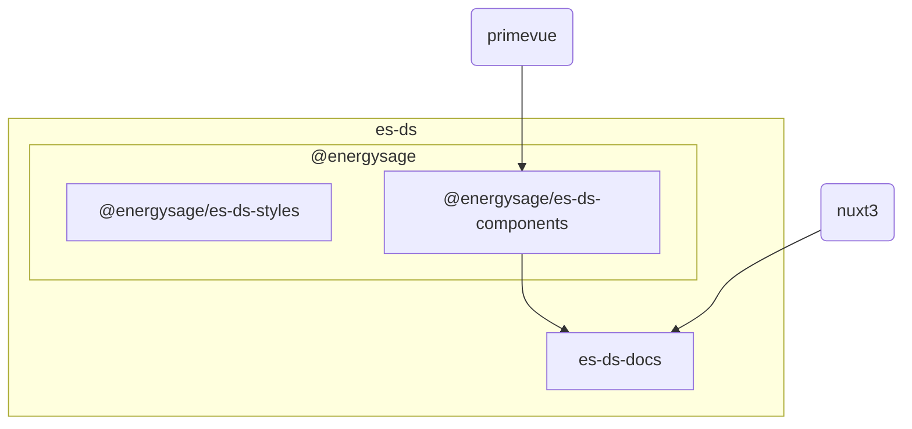

**NOTICE: this is a vue3 based design system, if you're working with a vue2 and/or bootstrap based micro-frontend, please see [EnergySage/es-ds-legacy](https://github.com/EnergySage/es-ds-legacy) instead**

# EnergySage Design System

This is a **monorepo** containing the elements required for building experiences
following the EnergySage Design System, or _es-ds_ for short.

- [Public works](#public-works)
- [The parts](#the-parts)
- [Contributing](#contributing)

## Public works

This repository `es-ds` **is public** and the contents are licensed under the
[MIT](https://tldrlegal.com/license/mit-license#summary)

For that reason discussion and documentation specific to EnergySage should probably be kept
within private org channels.

### EnergySage specific channels

For EnergySage specific resources & channels see the
[Quick Links section of the Design System confluence page](https://energysage.atlassian.net/wiki/spaces/DS/overview#%F0%9F%96%B1%EF%B8%8F-Quick-Links)

## The parts

Starting in version 3.0, the EnergySage Design System is composed of 2 core npm packages:

- [@energysage/es-ds-styles](https://www.npmjs.com/package/@energysage/es-ds-styles)
- [@energysage/es-ds-components](https://www.npmjs.com/package/@energysage/es-ds-components)



**es-ds-styles**

- [es-ds-styles](es-ds-styles/) started as a fork of **Bootstrap 4**.
- This package overrides the `_variables.scss` file in Bootstrap to the defaults required by the EnergySage design system.
- There are additional variables and colors that diverge and extend from the core
Bootstrap framework.
- The SASS has also been refactored to use
[the modular system](https://sass-lang.com/blog/the-module-system-is-launched/)
and dart-sass compiler.
- Prior to v3.0, `es-ds-styles` worked with the `es-vue-base` package, which is based on
[bootstrap-vue](https://bootstrap-vue.org/). As such, there are still some legacy
Bootstrap Vue styles present in `es-ds-styles`. Those are deprecated and will be removed
in a future version.

**es-ds-components**
- [es-ds-components](./es-ds-components/) contains Vue 3 components for use in Nuxt 3 projects.
It is primarily based on [PrimeVue](https://primevue.org/), with some customizations specific to EnergySage.

**es-ds-docs**
- This is the design system documentation site powered by Nuxt 3.
- It also serves a reference for
how to integrate `es-ds` packages into a Nuxt 3 project.

## Contributing

### Setting up the repo

clone `git@github.com:EnergySage/es-ds.git`

When publishing changes you will commit to the _origin_ branch of the _es-ds_
repo. So your git set-up should look like this:

```bash
$ git remote -v
origin  git@github.com:EnergySage/es-ds.git (fetch)
origin  git@github.com:EnergySage/es-ds.git (push)
```

### Installing Dependencies and Linking packages

1. `make install && make symlink` - installs all packages from npm

### Development workflow

```
make dev
```

This command will:

- Locally link your `es-ds-styles` and `es-ds-components` folders to the `es-ds-docs` Nuxt app
- Start the `es-ds-docs` local dev server

You can then make changes as desired in either upstream package folder and the local dev server should immediately reflect those changes.

```
make unlink
```

This command will:

- Undo the local linking set up by the above command
- Reinstall the public NPM versions of the `es-ds-styles` and `es-ds-components` packages

This enables you to run the `es-ds-docs` server with the state of code that is publicly available on NPM.

```
cd es-ds-docs
npm run dev
```

These commands will:
- Run the `es-ds-docs` local dev server without locally linking to the `es-ds-styles` and `es-ds-components` packages folders
- Whichever versions of the two upstream packages are installed (or already locally linked) will be used

### Updating the changelog

In your PR, make sure to include a section in the changelog documenting your
change. Following [keep a changelog](https://keepachangelog.com/en/1.0.0/)
conventions this will look similar to the following:

```markdown
## [Unreleased]

### Added

- Thing one

### Changed

- Thing two

```

This will make it easier to ensure all changes merged into `main` are captured
in the changelog when publishing a new release.

### Publishing and Versioning

Assuming changes are approved, the process of publishing a new version is...
0. Ensure your local environment is
   [setup](./README.md#installing-dependencies-and-linking-packages) and you are on
   the `main` branch
1. Make sure the package.json versions in `es-ds-styles` and `es-ds-components` is updated to a new version 
   that hasn't been published before on NPM.
2. `npm login` - Logs you into the npm.js registry. You'll need access to our `es-ds` package there in order for things to work.
3. `make install && make symlink` - Install and symlink dependencies locally
4. `make build` - Build all packages to `*/dist` folders locally
5. `make lint && make typecheck && make test` - Run tests and linting to ensure they pass
6. Publish updated packages to
   [npmjs.com](https://www.npmjs.com/org/energysage) with npm publish.
   1. `cd es-ds-styles && npm publish && cd ..`
   2. `cd es-ds-components && npm publish && cd ..`
7. Update [CHANGELOG.md](./CHANGELOG.md) with our newly published changes
8. `make update-package-deps` - Install the new published versions locally
9. `git commit -m "docs: :memo: add version X.X.X to the changelog" && git push` -
   Commit and push the changelog and `package-lock.json` updates

For updating the design-system website see 
[Deploy Design System](https://energysage.atlassian.net/wiki/spaces/CE/pages/1094058044/3.0+and+later+Deploy+Design+System+Documentation)
